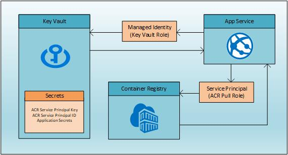

---
services:
- app-service
- key-vault
- azure-app-service
- azure-key-vault
platforms:
- dotnet
- linux
languages:
- csharp
products:
- azure
- dotnet
- aspnet
- azure-app-service
- azure-key-vault
author: aflinchb
description: "A sample ASP.NET Core WebAPI for bootstrapping your next App Service app using Managed Identity and Key Vault"
urlFragment: app-service-managed-identity-key-vault-csharp
page_type: sample
---

# Build an ASP.NET Core application using App Service, Managed Identity and Key Vault

This sample is an ASP.NET Core WebAPI application designed to "fork and code" with the following features:

- Securely build, deploy and run an App Service (Web App for Containers) application
- Securely store secrets in Key Vault
- Use Managed Identity to securely access Key Vault secrets from App Services
- Securely build and deploy the Docker container from Container Registry



## Prerequisites

- Azure subscription with permissions to create:
  - Resource Group, Keyvault, App Service, Azure Container Registry
- Bash shell (tested on Mac, Ubuntu, Windows with WSL2)
  - Will not work in Cloud Shell
- Azure CLI ([download](https://docs.microsoft.com/en-us/cli/azure/install-azure-cli?view=azure-cli-latest))
- Docker CLI ([download](https://docs.docker.com/install/))
- .NET Core SDK ([download](https://dotnet.microsoft.com/download))
- Visual Studio Code (optional) ([download](https://code.visualstudio.com/download))

## Setup

- Fork this repo and clone to your local machine
  - cd to the base directory of the repo

### Login to Azure and select subscription

```bash

az login

# show your Azure accounts
az account list -o table

# select the Azure account
az account set -s {subscription name or Id}

```

### Choose a unique DNS name

```bash

# this will be the prefix for all resources
# do not include punctuation - only use a-z and 0-9
# must be at least 5 characters long
# must start with a-z (only lowercase)
export mikv_Name=youruniquename

### if nslookup doesn't fail to resolve, change mikv_Name
nslookup ${mikv_Name}.azurewebsites.net
nslookup ${mikv_Name}.vault.azure.net
nslookup ${mikv_Name}.azurecr.io

```

### Create Resource Group

- When experimenting with this sample, you should create a new resource group to avoid accidentally deleting resources
  - If you use an existing resource group, please make sure to apply resource locks to avoid accidentally deleting resources
  
```bash

# set location
export mikv_Location=centralus
export mikv_MySecret=https://$mikv_Name.vault.azure.net/secrets/MySecret

# resource group names
export mikv_RG=${mikv_Name}-mikv-rg

# create the resource groups
az group create -n $mikv_RG -l $mikv_Location

```

Save your environment variables for ease of reuse and picking up where you left off

```bash

# run the saveenv.sh script at any time to save mikv_* variables to ~/${mikv_Name}.env
# make sure you are in the root of the repo
./saveenv.sh

# at any point if your terminal environment gets cleared, you can source the file
# you only need to remember the name of the env file (or set the $mikv_Name variable again)
source ~/{yoursameuniquename}.env

```

### Create Azure Key Vault

- All secrets are stored in Azure Key Vault for security
  - Use System Managed Identity to access Key Vault

```bash

## Create the Key Vault and add secrets
az keyvault create -g $mikv_RG -n $mikv_Name

# add a secret
az keyvault secret set --vault-name $mikv_Name --name "MySecret" --value "Hello from Key Vault and Managed Identity"

```

### Create and configure App Services

> App Service will fail to start until configured properly

```bash

# create App Service plan
az appservice plan create --sku B1 --is-linux -g $mikv_RG -n ${mikv_Name}-plan

# create Web App for Containers
# use System Managed Identity
az webapp create --deployment-container-image-name nginx --assign-identity '[system]' -g $mikv_RG -n $mikv_Name -p ${mikv_Name}-plan

# stop the Web App
az webapp stop -g $mikv_RG -n $mikv_Name

# get the Managed Identity
export mikv_MSI_ID=$(az webapp identity show -g $mikv_RG -n $mikv_Name --query principalId -o tsv)

# grant Key Vault access to Managed Identity
az keyvault set-policy -n $mikv_Name --secret-permissions get list --key-permissions get list --object-id $mikv_MSI_ID

### Configure Web App

# turn on container logging
# az webapp log config --docker-container-logging filesystem -g $mikv_RG -n $mikv_Name

# inject Key Vault secret
az webapp config appsettings set -g $mikv_RG -n $mikv_Name --settings MySecret="@Microsoft.KeyVault(SecretUri=$mikv_MySecret)"

export mikv_CONFIG=$(az webapp show -n $mikv_Name -g $mikv_RG --query id --output tsv)"/config/web"

# save your mikv_* environment variables for reuse
./saveenv.sh -y

# set to use docker hub image
az webapp config container set \
-n $mikv_Name \
-g $mikv_RG \
-r https://index.docker.io/v1 \
-i bartr/mikv:latest


### todo - this isn't working

# configure the Web App to use Container Registry
# get Service Principal Id and Key from Key Vault
#az webapp config container set \
#-n $mikv_Name \
#-g $mikv_RG \
#-i $mikv_Name.azurecr.io/mikv:latest \
#-r https://$mikv_Name.azurecr.io

#az resource update --ids $mikv_CONFIG --set properties.acrUseManagedIdentityCreds=true -o tsv

# restart the Web App
az webapp restart -g $mikv_RG -n $mikv_Name

# curl the health check endpoint
# this will eventually work, but may take a minute or two
# you may get a 403 error, if so, just run again

curl https://$mikv_Name.azurewebsites.net/healthz

# curl the /api/secret endpoint
curl https://$mikv_Name.azurewebsites.net/api/secret

```

## Setup Container Registry

> Create the Container Registry with admin access `disabled`

```bash

# create the ACR
az acr create --sku Standard --admin-enabled false -g $mikv_RG -n $mikv_Name

# Login to ACR
# If you get an error that the login server isn't available, it's a DNS issue that will resolve in a minute or two, just retry
az acr login -n $mikv_Name

# Build the container with az acr build
az acr build -r $mikv_Name -t $mikv_Name.azurecr.io/mikv .

```

## Clean up

- TODO add command to purge KV
- add command to delete RG

## Contributing

This project welcomes contributions and suggestions. Most contributions require you to agree to a Contributor License Agreement (CLA) declaring that you have the right to, and actually do, grant us the rights to use your contribution. For details, visit [Microsoft Contributor License Agreement](https://cla.opensource.microsoft.com).

When you submit a pull request, a CLA bot will automatically determine whether you need to provide a CLA and decorate the PR appropriately (e.g., status check, comment). Simply follow the instructions provided by the bot. You will only need to do this once across all repos using our CLA.

This project has adopted the [Microsoft Open Source Code of Conduct](https://opensource.microsoft.com/codeofconduct/). For more information see the [Code of Conduct FAQ](https://opensource.microsoft.com/codeofconduct/faq/) or contact [opencode@microsoft.com](mailto:opencode@microsoft.com) with any additional questions or comments.

## Trademarks

This project may contain trademarks or logos for projects, products, or services.

Authorized use of Microsoft trademarks or logos is subject to and must follow [Microsoft's Trademark & Brand Guidelines](https://www.microsoft.com/en-us/legal/intellectualproperty/trademarks/usage/general).

Use of Microsoft trademarks or logos in modified versions of this project must not cause confusion or imply Microsoft sponsorship.

Any use of third-party trademarks or logos are subject to those third-party's policies.
